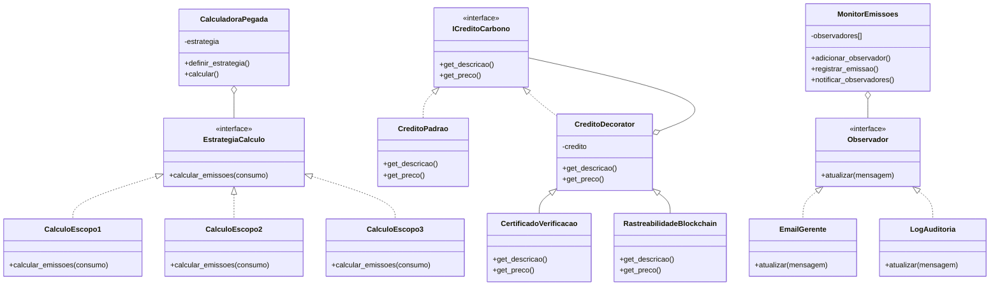

# Sistema de Mercado de Carbono

**Desenvolvido por:** Lucas Gilmar da Silva

**Disciplina:** Linguagem de Programação e Paradigmas
**Professor:** Esp. Ademar Perfoll Junior
**Curso:** Sistemas de Informação

---

## Problema do Domínio

O mercado de carbono é um sistema complexo que envolve:

- **Cálculo de Pegada de Carbono**: Empresas precisam medir suas emissões seguindo diferentes escopos (1, 2 e 3), cada um com métodos de cálculo específicos
- **Precificação de Créditos**: Créditos de carbono podem ter diferentes certificações e rastreabilidades que agregam valor ao produto
- **Monitoramento de Metas**: Organizações precisam acompanhar suas emissões em tempo real e ser alertadas quando ultrapassarem limites estabelecidos

Esses desafios requerem flexibilidade para trocar algoritmos, composição dinâmica de funcionalidades e notificações automáticas.

---

## Padrões Implementados

### 1. Strategy (Comportamental)

**Por que?** Diferentes escopos de emissões requerem cálculos distintos. O padrão Strategy permite trocar o algoritmo de cálculo em tempo de execução sem alterar o código cliente.

**Como resolve?**
- Define uma interface `EstrategiaCalculo` comum
- Implementa 3 estratégias concretas: `CalculoEscopo1`, `CalculoEscopo2`, `CalculoEscopo3`
- O `CalculadoraPegada` (Context) pode trocar dinamicamente a estratégia

**Exemplo de uso:**
```python
calc = CalculadoraPegada(CalculoEscopo1())
resultado = calc.calcular(100)  # Usa fator de combustível

calc.definir_estrategia(CalculoEscopo2())
resultado = calc.calcular(100)  # Agora usa fator de energia
```

**Localização:** `strategies/calculo_pegada.py`

---

### 2. Decorator (Estrutural)

**Por que?** Créditos de carbono podem ter certificações e funcionalidades adicionais agregadas de forma flexível e empilhável, sem criar subclasses para cada combinação possível.

**Como resolve?**
- Define interface `ICreditoCarbono`
- Implementa componente base `CreditoPadrao`
- Cria decoradores `CertificadoVerificacao` e `RastreabilidadeBlockchain` que envolvem o crédito base
- Permite empilhar múltiplos decoradores

**Exemplo de uso:**
```python
credito = CreditoPadrao()                      # R$ 50.00
credito = CertificadoVerificacao(credito)      # R$ 65.00
credito = RastreabilidadeBlockchain(credito)   # R$ 90.00
```

**Localização:** `decorators/certificados.py`

---

### 3. Observer (Comportamental)

**Por que?** Quando emissões ultrapassam metas, múltiplos sistemas (email, logs, auditoria) precisam ser notificados automaticamente, sem acoplamento forte.

**Como resolve?**
- Define interface `Observador`
- Implementa observadores concretos: `EmailGerente`, `LogAuditoria`
- O `MonitorEmissoes` (Subject) mantém lista de observadores e os notifica quando eventos ocorrem

**Exemplo de uso:**
```python
monitor = MonitorEmissoes(meta_maxima=100.0)
monitor.adicionar_observador(EmailGerente())
monitor.adicionar_observador(LogAuditoria())
monitor.registrar_emissao(60)  # Notifica ambos quando > 100
```

**Localização:** `observers/monitoramento.py`

---

## Estrutura do Projeto

```
TrabalhoDesignPatterns/
├── app/
│   ├── __init__.py
│   └── main.py              # Menu CLI interativo
├── strategies/
│   ├── __init__.py
│   └── calculo_pegada.py    # Strategy: escopos 1/2/3
├── decorators/
│   ├── __init__.py
│   └── certificados.py      # Decorator: certificações
├── observers/
│   ├── __init__.py
│   └── monitoramento.py     # Observer: alertas
├── domain/
│   └── __init__.py          # (entidades de domínio futuras)
├── infra/
│   ├── __init__.py
│   └── logger.py            # Infraestrutura de log
├── tests/
│   ├── __init__.py
│   └── test_padroes.py      # Testes unitários
└── README.md
```

---

## Diagrama de Classes (Simplificado)



---

## Como Instalar e Executar

### Pré-requisitos
- Python 3.7+

### Instalação

1. Clone o repositório:
```bash
git clone <url-do-repositorio>
cd TrabalhoDesignPatterns
```

2. Não há dependências externas. Python padrão é suficiente.

### Executar o Sistema

```bash
python3 app/main.py
```

### Executar Testes

```bash
python3 tests/test_padroes.py
```

**Saída esperada:**
```
...
----------------------------------------------------------------------
Ran 3 tests in 0.000s

OK
```

---

## Uso do Sistema

Ao executar `python3 app/main.py`, você verá:

```
=== SISTEMA DE MERCADO DE CARBONO ===
1. Strategy: Calcular Pegada (Escopos 1, 2, 3)
2. Decorator: Cotar Crédito com Certificados
3. Observer: Monitorar Metas de Emissão
0. Sair
```

### Opção 1: Strategy
- Digite o consumo (ex: 100)
- Escolha o tipo:
  - **1** = Combustível (Escopo 1): fator 2.5 kg CO2/litro
  - **2** = Energia (Escopo 2): fator 0.09 kg CO2/kWh
  - **3** = Viagem (Escopo 3): fator 0.15 kg CO2/km
- Sistema calcula e exibe a pegada de carbono

### Opção 2: Decorator
- Começa com crédito padrão (R$ 50.00)
- Adicione certificações opcionais:
  - Verificação ISO: +R$ 15.00
  - Blockchain: +R$ 25.00
- Sistema mostra o preço final composto

### Opção 3: Observer
- Define meta de 100.0 kg CO2
- Registre emissões incrementais
- Quando total > 100, sistema notifica:
  - Email para gerente
  - Log de auditoria

---

## Testes Implementados

### 1. `test_strategy_troca_dinamica`
Verifica que o Context pode trocar estratégias em runtime e obter resultados diferentes para o mesmo input.

### 2. `test_decorator_soma_precos`
Confirma que decoradores empilhados somam corretamente os preços (50 + 15 + 25 = 90).

### 3. `test_observer_notificacao`
Valida que observadores só são notificados quando a condição é violada (emissões > meta).

---

## Decisões de Design

### Linguagem: Python
- Sintaxe clara para demonstrar padrões
- Suporte nativo a ABCs (Abstract Base Classes)
- Tipagem opcional para documentação
- Facilita prototipação rápida

### Separação de Responsabilidades
- **strategies/**: Algoritmos intercambiáveis
- **decorators/**: Composição de funcionalidades
- **observers/**: Sistema de eventos
- **app/**: Interface de usuário
- **tests/**: Validação automatizada

### Uso de ABCs (Abstract Base Classes)
- Garante contratos de interface
- Força implementação de métodos obrigatórios
- Facilita manutenção e extensão

### Menu Interativo
- Demonstra todos os padrões em cenários reais
- Permite experimentação manual
- Exibe nome do desenvolvedor no rodapé (requisito do trabalho)

---

## Limitações

1. **Persistência**: Dados não são salvos entre execuções
2. **Validação**: Inputs do usuário têm validação mínima
3. **Concorrência**: Sistema não suporta múltiplos usuários simultâneos
4. **Fatores de Emissão**: Valores são simplificados para demonstração
5. **Internacionalização**: Apenas em português

---

## Próximos Passos

### Funcionalidades
- Persistência em banco de dados (Supabase)
- Histórico de cálculos e relatórios
- API REST para integração
- Dashboard web interativo
- Suporte a múltiplas moedas

### Padrões Adicionais
- **Factory Method**: Criar diferentes tipos de créditos
- **Singleton**: Configurações globais e cache de tabelas
- **Command**: Histórico de operações com undo/redo
- **Facade**: Simplificar API complexa para clientes

### Melhorias Técnicas
- Validação robusta de inputs
- Logs estruturados
- Métricas e monitoramento
- Testes de integração
- CI/CD automatizado

---

## Referências

- **Gamma, E. et al.** Design Patterns: Elements of Reusable Object-Oriented Software (GoF)
- **Greenhouse Gas Protocol**: Classificação de escopos de emissões
- **Python ABC Documentation**: https://docs.python.org/3/library/abc.html

---

## Contato

**Lucas Gilmar da Silva**
Sistemas de Informação - UNIDAVI

---

**Nota:** Este projeto foi desenvolvido para fins acadêmicos como parte da avaliação da disciplina de Linguagem de Programação e Paradigmas.
